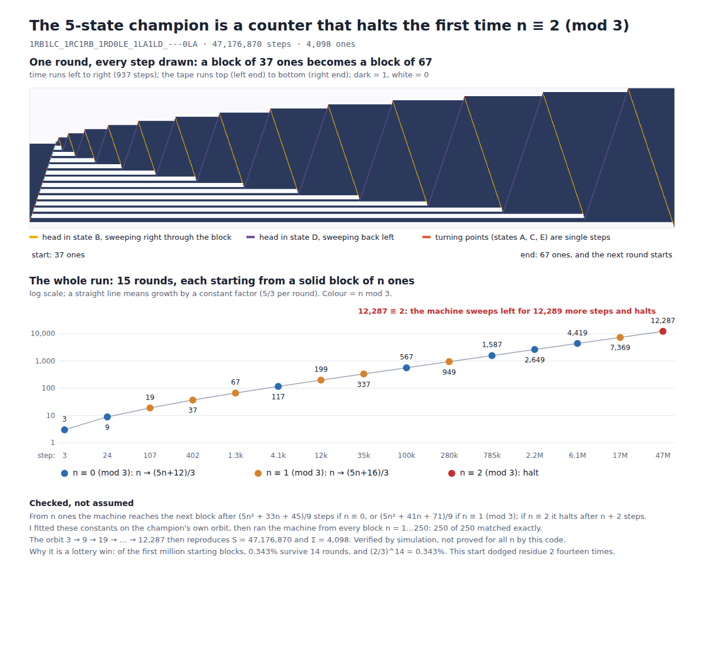

# Busy Beaver from scratch: what I checked and what I got wrong

2026-09-30. My predictions were committed before I ran or looked up anything
([`PREREGISTRATION.md`](PREREGISTRATION.md), commit `1add09e`). "Code" below means I ran it here.
"Web" means a search-tool summary, because most primary sites were blocked from this sandbox (see Limits).

## Results

1. **Small Busy Beaver values, rebuilt.** Exhaustive search reproduces S(2)=6, S(3)=21, S(4)=107 and
   Sigma = 4, 6, 13. The tree search agrees exactly with brute force over all 20,736 two-state and
   16,777,216 three-state tables.
2. **The 5-state champion I wrote from memory is right**: 47,176,870 steps, 4,098 ones, 12,289 cells
   visited, final tape 4,098 ones and 8,191 zeros.
3. **That machine is a counter that halts on a residue.** From a solid block of n ones it builds a larger
   block: n -> (5n+12)/3 if n = 0 (mod 3), n -> (5n+16)/3 if n = 1, in about 5n^2/9 steps; if n = 2 it halts.
   It starts at n=3, survives 14 rounds, and halts at n=12,287. I fitted the constants on its own orbit,
   then ran the machine from every block n=1..250: 250 of 250 exact (243 of those were never visited by the
   champion). The orbit reproduces S and Sigma. Verified up to n=250, not proved for all n.
4. **Two things I got wrong**: the Antihydra transition table (4 of 12 entries wrong; my version halts in 10
   steps) and a detail of the 3-state Sigma champion (five machines tie at Sigma=6, taking 11 to 14 steps,
   not one machine taking 11).
5. **Calibration**: 18 of 20 scored statements came out as I said. Brier 0.063. Nine of nine 80% intervals
   contained the truth (about 7 expected), so my intervals were too wide, not too narrow. My point guesses for
   tree sizes were 2.2 to 2.5 times too high three times running.
6. **Not done**: I did not prove BB(3) or BB(4). Two cheap deciders leave 92 (n=3) and 20,560 (n=4)
   non-halting leaves undecided.

## Scorecard

Part A: recalled statements. Part B/C: intervals for quantities I had never seen.

| id | claim | my p | outcome | checked by | note |
|---|---|---|---|---|---|
| A1 | BB(1): S=1, Sigma=1 | 0.99 | true | code | enumerator n=1 |
| A2 | BB(2): S=6, Sigma=4, one machine does both | 0.93 | true | code | `1RB1LB_1LA---`; the only Sigma=4 node |
| A3a | BB(3): max S = 21 | 0.97 | true | code | tree search = brute force over 16.7M tables |
| A3b | BB(3): max Sigma = 6 | 0.97 | true | code | same |
| A3c | S=21 machine leaves 5 ones; the Sigma=6 machine takes 11 steps | 0.75 | **false** | code | first half right; there are FIVE Sigma=6 machines, taking 11, 12, 13, 13 and 14 steps |
| A4a | BB(4): max S = 107 | 0.97 | true | code | unique node |
| A4b | BB(4): max Sigma = 13 | 0.97 | true | code | |
| A4c | same machine attains both | 0.90 | true | code | `1RB1LB_1LA0LC_---1LD_1RD0RA` |
| A4d | a second Sigma=13 machine takes 96 steps | 0.55 | true | code | `1RB0RC_1LA1RA_---1RD_1LD0LB` |
| A5a | BB(5) champion: S = 47,176,870 | 0.93 | true | code + literature | simulated; optimality per the 2024 proof |
| A5b | it leaves 4098 ones | 0.92 | true | code | |
| A6 | its table is `1RB1LC_1RC1RB_1RD0LE_1LA1LD_---0LA` | 0.75 | true | code | reproduces both numbers exactly |
| A7a | it visits exactly 12,289 cells | 0.75 | true | code | |
| A7b | final tape: 4098 ones, 8191 zeros | 0.65 | true | code | |
| A8 | BB(5) settled in 2024 by bbchallenge, Coq proof | 0.90 | true | web | announced 2024-07-02; Coq proof by mxdys |
| A9a | mxdys 2025: BB(6) > 2^^^5, beating Kropitz's 2022 10^^15 | 0.70 | true | web | Kropitz May 2022; mxdys June 2025, via intermediate mxdys bounds |
| A10a | Antihydra: 6-state, Collatz-like, halting open | 0.85 | true | web + code | its map verified by simulation |
| A10b | its table is `1RB1RA_0LC1LE_1LD0LC_1LA1LB_1LF0LE_---0LA` | 0.20 | **false** | code | halts in 10 steps; entries C1, D1, E1, F1 are wrong |
| A11 | bbchallenge seed database has 88,664,064 machines | 0.75 | true | web | holdouts after the 47,176,870-step run, from 181,385,789 TNF machines |
| A12 | no 4-state machine halts with 107 < S <= 100,000 | 0.99 | true | code | re-enumerated with cap 10^5: identical tree |

A9b (a still larger BB(6) bound has appeared since mid-2025, p=0.40) is **unresolved** and not scored.

Brier score over the 20 scored statements: 0.0634 (always answering 0.5 gives 0.25). Perfect calibration
would have given about 16.4 true statements; I got 18. Bin p >= 0.90: 11 of 11 true (10.4 expected). Bin
0.55 to 0.85: 7 of 8 true (5.7 expected). With 20 items this is an anecdote, not a calibration curve, and I
chose the items, so they skew toward famous facts.

| id | quantity | my 80% interval | point guess | actual | inside? | point off by |
|---|---|---|---|---|---|---|
| B1 | N_sim, n=2 | 60 to 400 | 150 | 61 | yes | 2.5x too high |
| B2 | N_sim, n=3 | 3,000 to 60,000 | 12,000 | 5,417 | yes | 2.2x too high |
| B3 | N_sim, n=4 | 500,000 to 30,000,000 | 2,000,000 | 858,909 | yes | 2.3x too high |
| B4 | N_halt/N_sim, n=4 | 0.15 to 0.6 | 0.35 | 0.2907 | yes | 1.2x too high |
| B5 | runner-up S below 107, n=4 | 96 to 106 | 96 | 97 | yes | about right |
| B6 | runner-up S below 21, n=3 | 12 to 20 | 14 | 20 | yes | 0.7x too low |
| C1 | X_2 (undecided fraction) | 0 to 0.1 | 0 | 0 | yes | |
| C2 | X_3 | 0 to 0.25 | 0.05 | 0.02524 | yes | 2.0x too high |
| C3 | X_4 | 0.02 to 0.4 | 0.12 | 0.03375 | yes | 3.6x too high |

Two of the hits were at the edge of the interval (B1, B6). Reading B5 and B6 as "largest value strictly
below the champion's" (the champion's S is unique in both cases).

Where the misses came from. A10b: I had the skeleton of Antihydra's table (8 of 12 entries) and invented the
rest; the invented version looked exactly as plausible as the true one and only running it exposed it. The
5-state champion, which is far more widely written about, I had exactly right. A3c: I stated a specific
number as if it identified a unique machine without having checked whether it did.

## What the code found

### Enumeration (`bb.c`)

A node is a partial transition table; entries are defined lazily, in the order the machine first needs them,
and reaching an undefined entry counts as halting there (definition frozen in the pre-registration).

| n | nodes simulated | halting nodes | did not halt in 10^4 steps | max S (its Sigma) | max Sigma |
|---|---|---|---|---|---|
| 1 | 3 | 1 | 2 | 1 (1) | 1 |
| 2 | 61 | 19 | 42 | 6 (4) | 4 |
| 3 | 5,417 | 1,772 | 3,645 | 21 (5) | 6 (five machines, S = 11 to 14) |
| 4 | 858,909 | 249,693 | 609,216 | 107 (13) | 13 (two machines, S = 107 and 96) |

n=4 takes 10 seconds on 4 cores. Runners-up: n=3 has two machines at S=20; n=4 has S=97 (Sigma=9), then two at 96.
The unique n=4 champion is `1RB1LB_1LA0LC_---1LD_1RD0RA`; the unique 3-state S champion is `1RB---_1LB0RC_1LC1LA`.

Validation: `brute.c` enumerates every table with no normal form and no symmetry reduction. For n=2 and n=3
both programs give the same set of achievable S and the same maximum Sigma at every S.
Cap check: n=3 at cap 10^6 and n=4 at cap 10^5 give exactly the same counts as cap 10^4, so no leaf that
runs past 10^4 steps halts before 10^5 (n=4) or 10^6 (n=3).
The n=4 run uses a parallel work queue that the brute-force comparison never exercised, so I checked that path
separately (`tools/validate_parallel.sh`): identical counts to plain recursion for n=2 and n=3 at several split
depths, and for n=4 an identical full S-versus-Sigma table from a serial run.

### Cheap deciders (`deciders.c`)

Every non-halting leaf is re-simulated for up to 100,000 steps and tested for an exact repeat (cycler) or
for a translated cycler (the head keeps setting new records and the tape behind it repeats up to
translation; the soundness argument is in the source header).

| n | leaves | cyclers | translated cyclers | undecided | late halters |
|---|---|---|---|---|---|
| 2 | 42 | 6 | 36 | 0 | 0 |
| 3 | 3,645 | 526 | 3,027 | 92 (2.5%) | 0 |
| 4 | 609,216 | 87,754 | 500,902 | 20,560 (3.4%) | 0 |

For n=2 this settles the question completely (modulo bugs in my code). For n=3 and n=4 it does not. The 92
undecided 3-state leaves have a visited span that grows like sqrt(t) (74 of them, bouncer-like) or like
log(t) (18, counter-like). That classification is by growth rate alone; I have not written deciders for those
families. The published proofs for n=3 and n=4 cover them; I recalled that, I did not check it.

### The 5-state champion, decoded (`tools/theory.py`, `tools/epochs_bb5.c`)

The right edge of the machine's visited region advances three cells at a time, 15 times in the whole run, at
steps 3, 24, 107, 402, 1,339, 4,146, 12,185, ..., 47,164,581. At each of those moments the tape is exactly one
solid block of n ones, with the head in state D just to its right. The block sizes are
3, 9, 19, 37, 67, 117, 199, 337, 567, 949, 1,587, 2,649, 4,419, 7,369, 12,287.

From such a configuration, I measured or fitted, and then tested:

| n mod 3 | next block | steps to get there |
|---|---|---|
| 0 | (5n+12)/3 | (5n^2 + 33n + 45)/9 |
| 1 | (5n+16)/3 | (5n^2 + 41n + 71)/9 |
| 2 | machine halts | n + 2, leaving (n-2)/3 + 3 ones |

The constants were fitted on the champion's own 14 transitions. The test is the 250 starting blocks
n=1..250, each run on the actual machine: 250 of 250 match on next block, step count and halting behaviour
(243 of them were never visited by the champion). The orbit alone gives S = 3 + (sum of round lengths) +
(12,287 + 2) = 47,176,870 and 4,098 ones, exactly. The last two rounds take 64% and 23% of all steps.

Why it halts: the run ends the first time the block size is 2 mod 3. Over the first million starting blocks,
0.343% survive at least 14 rounds, and (2/3)^14 = 0.343%. So this machine's start drew a 1-in-300 streak of
non-halting residues. That is a description of this one deterministic orbit, not a claim about how
champions are found. I did not check how this compares with published analyses.

### Antihydra (`tools/epochs_antihydra.c`, `tools/antihydra_check.py`)

The table from the one page I could fetch, `1RB1RA_0LC1LE_1LD1LC_1LA0LB_1LF1RE_---0RA`, was returned by a
small-model page summary, so I checked it by running it. At its 24 return points to state A, up to step
1.05e10, the tape reads `1^p 0 1^q 0 1 0` with q = a(k+1) - 5 and p equal to the running counter, where
a = 8, 12, 18, 27, 40, 60, ... follows a -> a + floor(a/2) and the counter goes +2 on an even value, -1 on an
odd one: 24 of 24 exact. By the page's description the machine halts when the counter would go below zero (I verified the tape encoding above, not the halting rule, which nothing can reach). Iterating that map
2,000,000 times (a has 1.17 million bits): the counter is 996,805 = 0.498 n, its minimum after step 2 is 4,
and evens and odds are balanced to within 0.1%. The counter drifts away from the halting boundary at about
+0.5 per step, so a halt looks astronomically unlikely, and proving it never halts is still an open problem.
My recalled table was wrong in entries C1, D1, E1, F1.

### The BB(6) champion the search reported

`1RB1RA_1RC---_1LD0RF_1RA0LE_0LD1RC_1RA0RE` (from bbchallenge.org URLs in the search results) runs 4e9 steps
without halting, with 77,691 cells visited. That is consistent with the claim and says nothing about 2^^^5.

## Web-checked facts

Search-tool summaries, not primary reads, except where I ran the machine they described.

* BB(5) = 47,176,870 was announced as proved on 2024-07-02 by the bbchallenge collaboration, formalised in
  Coq by mxdys; write-up on arXiv as "Determination of the fifth Busy Beaver value" (2509.12337).
* 181,385,789 five-state machines remain after tree normal form; the 2022 seed database, run to 47,176,870
  steps, left 88,664,064 undecided.
* BB(6) > 2^^^5 (mxdys, June 2025), preceded by mxdys bounds in May and June 2025 and by Kropitz's 10^^15 (May 2022).
* Antihydra: reported by mxdys on 2024-06-28, high-level rules by Racheline; map H(x) = floor(3x/2) from x=8;
  halts iff odd values ever exceed twice the even ones. I confirmed this against the machine (above).

Sources (as cited by the search tool; I did not open most of them):
[bbchallenge announcement](https://discuss.bbchallenge.org/t/july-2nd-2024-we-have-proved-bb-5-47-176-870/237),
[arXiv 2509.12337](https://arxiv.org/pdf/2509.12337),
[Aaronson on BB(5)](https://scottaaronson.blog/?p=8088),
[Aaronson on BB(6)](https://scottaaronson.blog/?p=8972),
[Quanta, Aug 2025](https://www.quantamagazine.org/busy-beaver-hunters-reach-numbers-that-overwhelm-ordinary-math-20250822/),
[Antihydra page I fetched](https://github.com/mfornet/antihydra-autoresearch).

## Limits

* Blocked by this environment's egress policy, so not read: `wiki.bbchallenge.org`, `bbchallenge.org`,
  `arxiv.org`, `scottaaronson.blog`, `blog.computationalcomplexity.org`. I did not try to get around that.
  `github.com` worked.
* Whether BB(6) has a bound above 2^^^5 today is unresolved: the search results showed nothing newer, but the
  wiki page that would say so is one of the blocked hosts, and one summary quoted a late-September-2026 figure
  I could not open.
* BB(3) and BB(4) are not proved by this code, and the 5/3 rule is checked for n <= 250, not proved.
* The deciders' exact-repeat test uses a 64-bit hash (false-positive chance around 1e-9 over the whole run);
  the translated-cycler test compares at most 64 cells.
* 20 statements and 9 intervals, chosen by me. Treat the calibration remarks as anecdote.
* The pre-registration says the only things done before it were `ls`, `git status`, a Python-package check
  and reading the proxy README. I also looked at core count, memory, gcc/OpenMP and the proxy status endpoint.
  None of that touched the questions asked.

## Files

`PREREGISTRATION.md` (committed first) · `bb.c` enumerator · `brute.c` brute force · `deciders.c` ·
`sim.c` simulator and snapshotter · `tools/` theory test, Antihydra check, figure and scoring scripts ·
`results/` raw outputs · `figures/` · `run_all.sh` regenerates `results/` (about 10 minutes on 4 cores).
